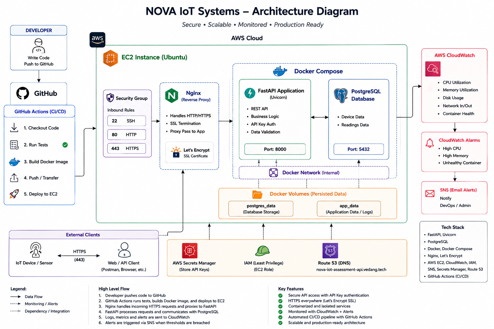

# NOVA IoT Systems

Cloud Engineering Internship Assessment

A containerized IoT monitoring API deployed on AWS EC2 with PostgreSQL, Nginx, HTTPS, CloudWatch monitoring, API-key authentication, and GitHub Actions CI/CD.

## 1. Project Overview

This project implements a small cloud-hosted IoT monitoring backend.

The application exposes REST endpoints for device and environmental reading data and uses PostgreSQL for persistent storage.

The deployment is designed to be simple, reproducible, secure, and inexpensive while still demonstrating production-oriented cloud engineering practices.

### Main goals

- Deploy a working API to AWS.
- Connect the application securely to PostgreSQL.
- Containerize the application and database.
- Expose the API through HTTPS.
- Protect API operations using API-key authentication.
- Monitor the server and Nginx logs using CloudWatch.
- Automate testing, Docker builds, and deployment with GitHub Actions.
- Document how the architecture can evolve for larger IoT workloads.

---

## 2. Architecture

The current production flow is:

```text
                    Internet
                       |
                       | HTTPS
                       v
                  +---------+
                  |  Nginx  |
                  +---------+
                       |
                       | Reverse Proxy
                       v
                +-------------+
                |   FastAPI   |
                |   Docker    |
                +-------------+
                       |
                       | Internal Docker Network
                       v
                +-------------+
                | PostgreSQL  |
                |   Docker    |
                +-------------+
```

CI/CD and monitoring:

```text
Developer
    |
    v
 GitHub
    |
    v
GitHub Actions
    |
    +--> Tests
    |
    +--> Docker Build
    |
    +--> SSH Deployment
             |
             v
          AWS EC2
             |
             +--> Docker Compose
             +--> Nginx
             +--> FastAPI
             +--> PostgreSQL
             |
             +--> CloudWatch Agent
                       |
                       +--> Nginx access logs
                       +--> Nginx error logs
                       +--> Server metrics
```

Architecture diagram:



Detailed architecture documentation is available in [`docs/architecture.md`](docs/architecture.md).

---

## 3. Technologies Used

### Application

- Python 3.12
- FastAPI
- Uvicorn
- PostgreSQL
- SQLAlchemy
- Pytest

### Containerization

- Docker
- Docker Compose

### Cloud and Infrastructure

- AWS EC2
- Ubuntu
- Nginx
- Let's Encrypt
- Amazon CloudWatch

### CI/CD

- GitHub Actions
- SSH-based deployment

---

## 4. Cloud Provider

The application is deployed on **Amazon Web Services (AWS)** using an EC2 instance.

The EC2 server runs Ubuntu and hosts the Dockerized application stack.

The public API is available at:

**https://nova-iot-assessment-api.vedang.tech**

The deployment uses a single EC2 instance because the current workload is small and the assessment prioritizes a simple, low-cost architecture.

---

## 5. Repository Structure

```text
NOVA-IoT-Systems-Internship-Assessment/
│
├── README.md
│
├── architecture/
│   └── architecture-diagram.png
│
├── application/
│   ├── app/
│   ├── tests/
│   └── requirements.txt
│
├── docker/
│   ├── Dockerfile
│   └── docker-compose.yml
│
├── infrastructure/
│   └── ...
│
├── docs/
│   ├── architecture.md
│   ├── deployment.md
│   ├── security.md
│   ├── monitoring.md
│   ├── scalability.md
│   └── failure-scenario.md
│
├── .github/
│   └── workflows/
│       └── ci-cd.yml
│
└── .gitignore
```

---

## 6. Setup Instructions

### Prerequisites

Install:

- Python 3.12+
- Docker
- Docker Compose
- Git

Clone the repository:

```bash
git clone <repository-url>
cd NOVA-IoT-Systems-Internship-Assessment
```

### Application dependencies

```bash
cd application
pip install -r requirements.txt
```

### Environment configuration

Create the required environment configuration according to the variables used by the application.

Example:

```env
DATABASE_URL=postgresql+psycopg://postgres:<password>@postgres:5432/<database>
API_KEY=<your-api-key>
```

Do not commit `.env` files or real credentials to Git.

---

## 7. Docker

The application is containerized using Docker.

Build and start the services:

```bash
docker compose -f docker/docker-compose.yml up -d --build
```

Check the running containers:

```bash
docker ps
```

Check Compose services:

```bash
docker compose -f docker/docker-compose.yml ps
```

Stop the services:

```bash
docker compose -f docker/docker-compose.yml down
```

The FastAPI application listens on port `8000` inside the Docker deployment.

PostgreSQL communicates with the application through the Docker network.

---

## 8. API Endpoints

The API provides endpoints for application health, devices, and sensor readings.

| Method | Endpoint | Purpose |
|---|---|---|
| GET | `/health` | Application health check |
| GET | `/api/devices` | Retrieve devices |
| POST | `/api/readings` | Submit a sensor reading |
| GET | `/api/readings` | Retrieve sensor readings |

### Health Check

```bash
curl https://nova-iot-assessment-api.vedang.tech/health
```

Expected response:

```json
{
  "status": "ok",
  "message": "API is running"
}
```

Protected endpoints require the configured API key.

Example:

```http
X-API-Key: <your-api-key>
```

---

## 9. Database

PostgreSQL is used as the application's persistent database.

The database is configured through environment variables rather than hardcoded credentials.

The database is not intended to be publicly accessible.

The application communicates with PostgreSQL over the internal Docker network.

Database data is persisted through the Docker Compose database volume.

---

## 10. Security

The application implements several security controls:

- HTTPS/TLS through Nginx and Let's Encrypt.
- API-key authentication.
- CORS configuration.
- Environment-based secrets.
- GitHub repository secrets for CI/CD credentials.
- PostgreSQL kept behind the application/network boundary.
- SSH key-based authentication.
- EC2 security group controls.
- `.env` and private credentials excluded from Git.

Detailed security risks and mitigations are documented in [`docs/security.md`](docs/security.md).

---

## 11. Networking

The public request flow is:

```text
Client
  |
  | HTTPS :443
  v
Nginx
  |
  | Reverse Proxy
  v
FastAPI :8000
  |
  | Docker Network
  v
PostgreSQL :5432
```

Nginx is the public-facing reverse proxy.

The FastAPI application does not need to be directly exposed to the internet when Nginx is handling external traffic.

PostgreSQL should not be exposed publicly.

---

## 12. Deployment

The application is deployed on AWS EC2.

The production server contains:

- Ubuntu
- Docker
- Docker Compose
- Nginx
- FastAPI container
- PostgreSQL container
- CloudWatch Agent

The deployment process is documented in [`docs/deployment.md`](docs/deployment.md).

### Production deployment

The application can be started with:

```bash
docker compose -f docker/docker-compose.yml up -d --build
```

---

## 13. CI/CD

GitHub Actions automates the application deployment.

The workflow runs when code is pushed to the `Main` branch.

```text
Git Push
   |
   v
Checkout
   |
   v
Install Dependencies
   |
   v
Run Tests
   |
   v
Docker Build
   |
   v
SSH to EC2
   |
   v
git pull origin Main
   |
   v
docker compose up -d --build
```

The pipeline contains:

- Automated dependency installation.
- Automated tests using Pytest.
- Docker image build.
- Automated deployment to EC2.

Deployment credentials are stored as GitHub repository secrets.

---

## 14. Monitoring and Logging

Amazon CloudWatch is used for infrastructure monitoring and centralized log collection.

The CloudWatch Agent collects Nginx logs:

```text
/var/log/nginx/access.log
/var/log/nginx/error.log
```

The system can be monitored for:

- CPU utilization.
- Memory utilization.
- Disk usage.
- Network activity.
- Nginx errors.
- API availability.
- Container health.
- PostgreSQL health.

The application also provides `/health` for basic availability checks.

Detailed monitoring information is available in [`docs/monitoring.md`](docs/monitoring.md).

---

## 15. Scalability Approach

The current single-EC2 deployment is intentionally small.

If the system grows to hundreds of farms and thousands of IoT devices, the architecture should evolve toward:

```text
IoT Devices
     |
     | MQTT
     v
MQTT Broker
     |
     v
Message Queue / Stream
     |
     v
Processing Workers
     |
     v
Database
```

The API tier could be horizontally scaled behind a load balancer:

```text
Load Balancer
      |
      +---- FastAPI 1
      +---- FastAPI 2
      +---- FastAPI N
```

Possible future improvements include:

- Horizontal application scaling.
- Application Load Balancer.
- MQTT-based device ingestion.
- Message queues.
- Managed PostgreSQL/RDS.
- Redis caching.
- Container orchestration.
- Database read replicas and partitioning.
- Centralized dashboards and alerts.

The complete scalability discussion is available in [`docs/scalability.md`](docs/scalability.md).

---

## 16. Failure Handling

If the API becomes unavailable, troubleshooting starts from the external request path and moves inward:

```text
Client
  |
  v
DNS
  |
  v
Nginx / EC2
  |
  v
FastAPI
  |
  v
PostgreSQL
```

The investigation includes:

1. Reproducing the failure.
2. Checking DNS.
3. Checking EC2 health.
4. Checking security group/networking.
5. Checking Nginx.
6. Checking Docker containers.
7. Checking FastAPI logs.
8. Checking PostgreSQL health.
9. Checking CloudWatch.
10. Checking recent CI/CD deployments.

The complete troubleshooting procedure is documented in [`docs/failure-scenario.md`](docs/failure-scenario.md).

---

## 17. Known Limitations

The current implementation is intentionally designed for a small assessment workload.

Known limitations include:

- Single EC2 instance creates a single point of failure.
- No load balancer is currently used.
- PostgreSQL is hosted on the same EC2 instance as the application.
- No MQTT ingestion layer is currently implemented.
- No message queue is currently implemented.
- No distributed cache is currently implemented.
- The `/health` endpoint currently verifies application availability rather than providing a complete dependency health report.
- No automated rollback mechanism is currently implemented.

These are deliberate trade-offs for a small, low-cost deployment.

---

## 18. Future Improvements

For a larger production deployment, I would consider:

1. Move PostgreSQL to Amazon RDS.
2. Run multiple FastAPI instances behind an Application Load Balancer.
3. Introduce MQTT for IoT device ingestion.
4. Add a message queue or streaming platform.
5. Add Redis for frequently accessed data.
6. Introduce autoscaling.
7. Add automated rollback to the CI/CD pipeline.
8. Use AWS Secrets Manager for secret management.
9. Replace direct SSH deployment with a managed deployment mechanism.
10. Add centralized dashboards and alerting.
11. Add automated vulnerability scanning.
12. Add database backups and disaster recovery.

---

## 19. Documentation

Additional documentation:

- [Architecture](docs/architecture.md)
- [Deployment](docs/deployment.md)
- [Security](docs/security.md)
- [Monitoring](docs/monitoring.md)
- [Scalability](docs/scalability.md)
- [Failure Scenario](docs/failure-scenario.md)

---

## 20. Final Status

The current implementation demonstrates:

- Working cloud deployment.
- Containerized application and database.
- HTTPS reverse proxy.
- API-key authentication.
- CORS configuration.
- PostgreSQL connectivity.
- CloudWatch monitoring and logging.
- Automated testing.
- Docker image builds.
- Automated EC2 deployment through GitHub Actions.

The architecture is intentionally simple while providing a clear path toward horizontal scaling and an IoT-oriented ingestion architecture.
